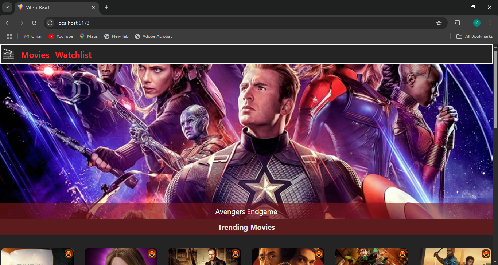
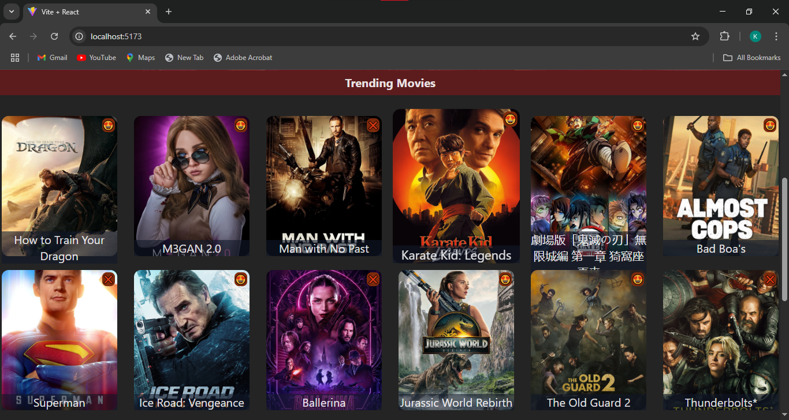
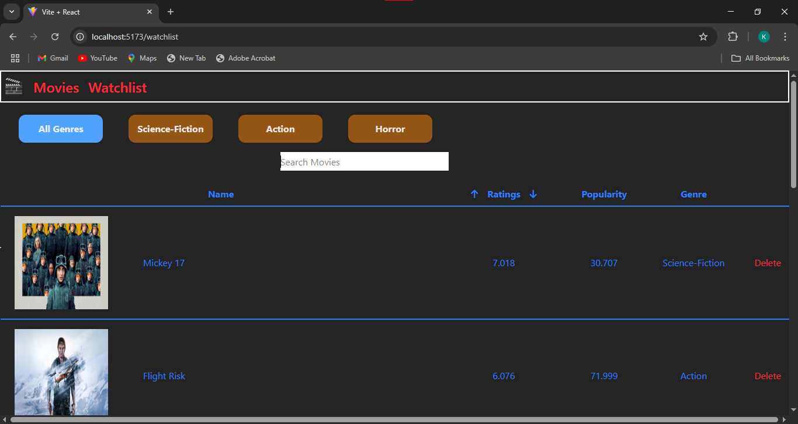

## 🎬 IMDB Clone
- A React-based IMDB Clone that leverages the TMDB API to deliver real-time movie data. This web application replicates the core features of the popular IMDB platform, enabling users to:

- ✅ Explore the latest trending movies
- ✅ Filter movies by ratings and genres
- ✅ Search for specific movies
- ✅ Add favorite movies to a personalized watchlist
- ✅ Remove movies from the watchlist

---

### 🚀 Features
- 📌 Latest Movies: Fetch and display popular and latest movies using TMDB API.
- 🔍 Search Functionality: Instantly search for any movie by name.
- 🏷️ Genre Filtering: View movies categorized by genres.
- ⭐ Ratings Filter: Filter movies based on user ratings.
- 📄 Detailed Movie View: See detailed information about each movie.
- ❤️ Watchlist: Add and manage your favorite movies in a personal watchlist.
- 🗑️ Watchlist Management: Remove movies from the watchlist easily.

---

### 📸 Screenshots

### Home Page

### Trending Movies

### WatchList

---

### 🛠️ Technologies Used
- React JS (Frontend)
- TMDB API (for fetching movie data)
- React Router (for navigation)
- CSS / Tailwind CSS (for styling - specify which you used)
- Local Storage / Redux / Context API (for watchlist management - specify which one you used)

---

### 📦 Setup & Installation

#### Clone the repository:
- git clone https://github.com/your-username/imdb-clone.git
- cd imdb-clone

#### Install dependencies
- npm install
- 
#### Configure TMDB API
- Create a .env file in the root directory and add your TMDB API key:
- VITE_TMDB_API_KEY=your_tmdb_api_key
  
#### Start the application
- npm run dev
  
#### Open your browser and navigate to:
- http://localhost:5173
  
---

### 👨‍🎓 Author
- Kumaresan D

### 🚀 Future Enhancements
- User authentication & persistent watchlist
- Pagination for search results
- Movie recommendations
- Responsive UI improvements
- Dark/Light theme toggle
